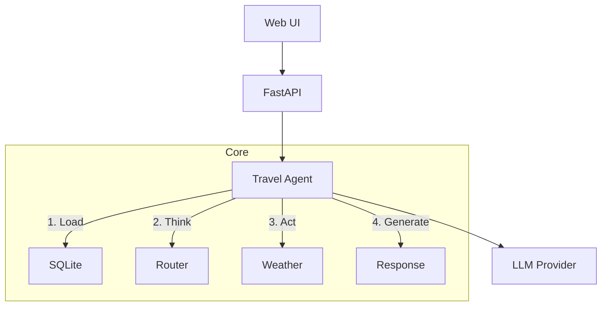

# Yalla Trip

AI-powered travel assistant with multi-turn conversations, weather integration, and trip planning.


## Features

- **Conversations** — Multi-turn dialogue with context memory
- **Weather** — Real-time data via Open-Meteo API
- **Intent Detection** — Routes between trip planning, packing, and attractions

See [Prompt Engineering](docs/PROMPT_ENGINEERING.md) for design decisions.

## Quick Start

### Option 1: Local LLM (Ollama)

```bash
# Install Ollama from https://ollama.com/download, then:
ollama pull llama3.2:3b

# Setup
make install
cp .env.example .env   # Uses Ollama by default, no changes needed

# Run
make run
```

### Option 2: Cloud LLM

```bash
make install
cp .env.example .env

# Edit .env:
# LLM_PROVIDER=openai
# LLM_MODEL=gpt-4o
# OPENAI_API_KEY=sk-your-key

make run
```

Open `http://localhost:8000`

## Architecture



## Development

```bash
make test      # Run tests
make lint      # Format code
make run       # Dev server
make build     # Docker build
```
